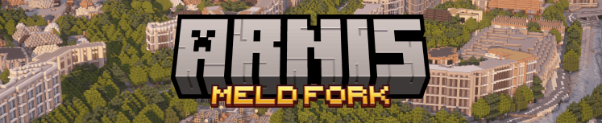
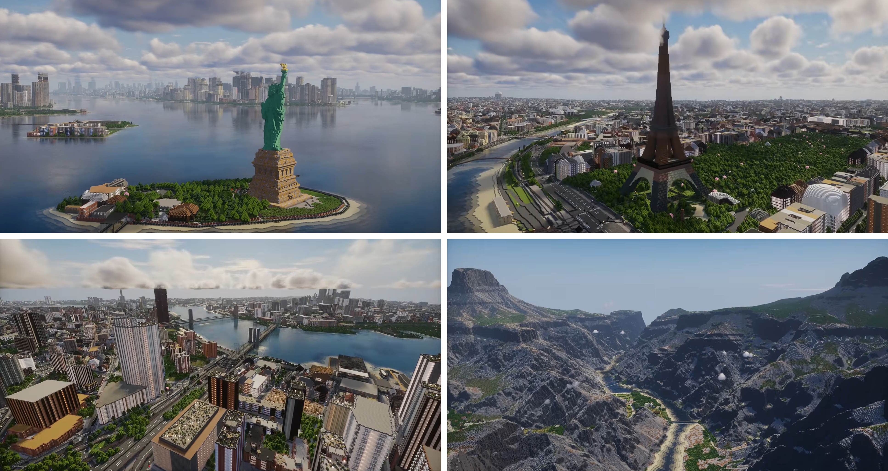

# Arnis Meld Fork

Real-world Minecraft worlds, tuned for large-scale parallel generation.

A fork of [Arnis](https://github.com/louis-e/arnis) by louis-e, tuned for large-scale parallel generation with [Meld](https://github.com/Teddy563/meld), an orchestrator that runs Arnis at scale over a whole region.

[](https://github.com/louis-e/arnis/actions) [](https://github.com/louis-e/arnis/releases) [](https://github.com/louis-e/arnis/releases) [](https://github.com/louis-e/arnis/releases) [](https://discord.gg/mA2g69Fhxq)

> Fork note: this repository keeps full parity with upstream Arnis and adds a set of opt-in flags for seamless multi-tile generation. Every fork flag is purely additive. Omit them and the binary behaves exactly like upstream.

Arnis creates complex and accurate Minecraft Java Edition (1.17+) and Bedrock Edition worlds that reflect real-world geography, topography, and architecture.

This free and open source project is designed to handle large-scale geographic data from the real world and generate detailed Minecraft worlds. The algorithm processes geospatial data from OpenStreetMap as well as elevation data to create an accurate Minecraft representation of terrain and architecture.
Generate your hometown, big cities, and natural landscapes with ease!

The Meld fork keeps that core and focuses on one extra goal: rendering many adjacent tiles into one shared world with no visible seams, so an external orchestrator (Meld) can build whole regions in parallel.



## :sparkles: What this fork adds

Everything below is optional. The flags exist so that adjacent tiles, generated by separate processes, line up block-for-block and read cleanly at small scales. If you run the binary with none of these flags, you get stock upstream behaviour.

### Elevation and terrain

**What a run generates (`--mode`).** `--mode geo-terrain|geo-only|terrain-only` is the documented way to choose what comes out of a run:

| Value | OSM/Overture objects | Ground |
| --- | --- | --- |
| `geo-terrain` | yes | real elevation |
| `geo-only` | yes | flat, at `--ground-level` |
| `terrain-only` | no | real elevation |

`terrain-only` skips **both** object sources: no Overpass query, no `--osm-tile-dir` read, and no Overture fetch. `--overture` has no effect in that mode, and `--file` / `--osm-tile-dir` / `--save-json-file` are ignored (the run says so on stderr).

**This fork defaults terrain OFF.** With neither flag, a run renders flat ground — unlike upstream, which defaults to `geo-terrain`. That default is deliberate and load-bearing: archived commands and stored projects select flat vs. real elevation purely by emitting or omitting `--terrain`.

`--terrain` remains fully supported and is exactly `--mode geo-terrain`; omitting it is exactly `--mode geo-only`. It is hidden from `--help` only because `--mode` is now the documented spelling — that is why the flag no longer appears there even though the examples below still use it. Passing `--terrain` together with `--mode geo-only` is a contradiction and is rejected.

```
arnis --output-dir ./world --bbox <bbox> --mode terrain-only
```

**Shared elevation band (no height seams).** Each tile picking its own min/max height makes neighbouring tiles meet at a vertical staircase. Pin one shared real-world band in metres so every tile maps height to the same Y. Set both together, alongside a master origin.

```
arnis --output-dir ./world --bbox <cell-bbox> --terrain \
  --master-origin-lat 52.5200 --master-origin-lng 13.4050 \
  --elevation-min 0 --elevation-max 1200
```

**Shared master origin (tile mode).** Many adjacent bounding boxes baked into one world must share a single coordinate ruler, or they slide 1 to 3 blocks off the roads and disagree at the edges. The master origin anchors the projection and the elevation/land-cover grid to one global lat/lng, and flips Arnis into tile mode (it skips the per-run stale-tile cache cleanup and the global outlier-filter pass). This also fixes a roughly 0.1% average-latitude haversine stretch. Both values are required together.

```
arnis --output-dir ./world --bbox <cell-bbox> \
  --master-origin-lat 52.5200 --master-origin-lng 13.4050
```

**Vertical exaggeration (taller mountains, same footprint).** At small scales real relief flattens out. `--vertical-exaggeration <FACTOR>` multiplies terrain height only, not the map footprint, and auto-compresses to the build height. Default 1.0.

```
arnis --output-dir ./world --bbox <bbox> --terrain --vertical-exaggeration 2.0
```

**Snow control.** `--snow-mode off|realistic|peaks|manual` places snow at the real latitude snow line, on the top N percent of the world's height (`--snow-percent`), or above a fixed Y (`--snow-y`).

```
arnis --output-dir ./world --bbox <bbox> --terrain --snow-mode peaks --snow-percent 15
```

**Terrain zoom cap (lighter, hole-free elevation).** The z14/z15 Terrarium tiles have real no-data holes and multiply the tile count, while a coarser zoom still carries the full roughly 30 m signal. Cap the terrain tile zoom for the whole run with an environment variable. There is no CLI flag for this. The value is clamped to the valid zoom band.

```
# bash
ARNIS_ELEV_ZOOM=13 arnis --output-dir ./world --bbox <bbox> --terrain
# PowerShell
$env:ARNIS_ELEV_ZOOM='13'; arnis --output-dir ./world --bbox <bbox> --terrain
```

**Warm the terrain cache first.** When many parallel cells each hit S3 at once (around 64 concurrent), they get rate-limited and receive truncated tiles, which become flat seams. This pre-fetches all AWS terrain tiles for the bounding box serially in one pass (8 concurrent), then exits. Only `--bbox` is required. Exit code 0 means all tiles cached, 2 means some failed.

```
arnis --bbox <region-bbox> --download-terrain-only
```

**Hard offline elevation.** Lets a batch run generate strictly from a pre-warmed cache so no cell quietly hammers S3 or the regional providers. Cache hits are served as normal, but a cache miss or a corrupt tile returns an error instead of re-downloading (Arnis then falls back to flat ground). Pair this with a prior `--download-terrain-only`.

```
arnis --output-dir ./world --bbox <bbox> --terrain --offline
# alias: --elevation-cache-only
```

### Water and shores

**Big-water, shore, and wetland rendering.** Oceans, rivers, lakes, and their shores were the long-running artifact source (stepped water, double slopes, AIR holes, stray sand, stairstep shores). The fork carries a multi-pass water, underwater, shore, and wetland system: a flat per-component water surface, a single-cell sand shore swap that stays faithful to upstream, a depth-tiered bed palette, water that flows under bridges, a stoney-shore ring, and thin-land drowning. There is no dedicated flag. It runs automatically when terrain is on, and the shore and water noise responds to the seed value.

```
arnis --output-dir ./world --bbox <bbox> --terrain --seed 42
```

### Caves and underground

**Vanilla-style cave worldgen (`--caves`).** A from-scratch Rust port of Minecraft 1.21.8 cave generation, carved into the filled ground at generation time: the vanilla noise density field (cheese caverns, spaghetti tunnels, entrance pockets, pillars, noodle worms) sampled with vanilla's 4x8x4 cell interpolation, plus the random-walk tunnel and ravine carvers. On top of the vanilla base: pool caves (half-flooded, grand and coral-reef variants), long snake rivers that breach into caves only while descending, a contained deep lava sea below y=-54 with obsidian and magma rims, the vanilla ore table plus stone-variant patches, amethyst geodes, and 8 cave biome themes (lush, dripstone, deep dark, mushroom, ice under mountains only, amethyst, volcanic at the bottom of the world, coral in water pools) with plain-rock buffers between zones. Every pass is a pure function of (seed, position), so adjacent tiles carve identical caves at their shared seam. Implies `--fillground`; `--vanilla-caves` is a legacy alias.

```
arnis --output-dir ./world --bbox <bbox> --terrain --caves
```

**Cave asset packs.** A `cave-pack/` directory next to the executable (or `--cave-asset-pack <DIR>`) supplies Sponge `.schem` formations, ice spikes, dripstone columns, amethyst clusters, clay pool basins, stamped onto cave floors and ceilings, themed by biome zone, with block states preserved and rotated. Formations sink into the ground, clip safely against walls, and never touch fluids. Without the directory, caves generate fully with procedural decoration only.

**Cave biome mix (`--cave-biomes <list>`).** Per-theme amounts as `name=percent` pairs: 100 = the default share, 0 = theme off, 200 ≈ double its area. The percent shifts that theme's noise threshold on a log2 curve, so the field stays a pure function of seed + position (seam-safety unaffected) and omitting the flag reproduces the default distribution byte-for-byte. Depth/terrain gates always apply (volcanic bottom-only, deep dark below the deepslate line, ice under mountains, coral in water pools).

```
arnis --output-dir ./world --bbox <bbox> --terrain --caves \
  --cave-biomes lush=150,deepdark=0,amethyst=50
```

**Zone-layout preview (`--cave-zone-map <prefix>`).** Renders the cave biome layout for `--bbox` without generating a world: `<prefix>-upper.png` and `<prefix>-deep.png` (transparent where the cave is plain rock) plus a `ZONEMAP {json}` stdout line with the measured share of every theme. Uses the exact zone picker, seed and `--cave-biomes` values generation uses, so the preview IS the layout the world gets. `--cave-zone-map-step <blocks>` samples one zone per N×N square for a chunky noise-cell view.

```
arnis --bbox <bbox> --scale 0.1 --tile-invariant-rendering 42 --cave-zone-map ./zones
```

### Trees and vegetation

**Schematic tree packs (`--tree-pack <DIR>`).** Points the generator at a directory of Sponge `.schem` tree models plus a `region.json` manifest and places those models instead of the built-in procedural trees: a realm by location, a community by terrain, then a weighted species, blended with vanilla trees, inside the normal tree-spawn pass so density and clearings stay natural. Without the flag, procedural trees are unchanged. `--tree-sizes small,medium,big,tall,giant` gates which height tiers may place (a disabled tier falls back to a smaller one; large tiers are gated off at small scales).

```
arnis --output-dir ./world --bbox <bbox> --tree-pack ./packs/eur --tree-sizes small,medium,big
```

### Buildings and structures

**Drop all buildings.** A roads-and-ground-only world is the ideal Meld base layer, and it skips the heavier, more error-prone building geometry. This flag skips OSM buildings plus building-adjacent man_made, power, barriers, doors, advertising, historic, emergency, and tourism features. It deliberately keeps parking and some leisure and surface features. Roads, rail, water, land cover, and terrain all stay.

```
arnis --output-dir ./world --bbox <bbox> --no-buildings
# alias: --no-structures
```

**Tile-invariant building rendering (seam-free buildings).** A building that straddles two tiles otherwise gets a different palette per cell and shows a visible seam. With this on, the building decisions (skyscraper or not, footprint, diagonality, start-Y) read pre-clip bounds, and every RNG stream mixes in the seed, so a building renders byte-identical in both tiles. A bare flag means seed 1, an omitted flag means upstream behaviour.

```
arnis --output-dir ./world --bbox <cell-bbox> --tile-invariant-rendering 42
# alias: --seed 42
```

### Bridges and roads

**Flat low-scale bridges (automatic).** At 1:3 or smaller, a rising arch bridge with columns and clearance collapses into a tangle of noise and overshoots the now-tiny span. At `--scale 0.3` or lower, every bridge becomes a flat 1-block deck that hugs the terrain (the Beam style is forced, no arch). This is not a flag of its own. It is triggered purely by the scale value.

```
arnis --output-dir ./world --bbox <bbox> --scale 0.1
```

**Road detail modes (legible low-scale roads).** At sub-meter resolution, footways, crosswalks, lane dividers, and multi-lane widths stack onto the same blocks as dotted-checker noise. The modes trade detail for legibility:

- `max` (default): upstream exact.
- `clean`: visual cleanup for scale 0.7 and above (caps dividers, twin-stripe, tidier dashes).
- `compact`: vehicle roads only (skips footway, path, cycleway, steps, pedestrian, platform, bus_stop, service, track, and crossings, and caps lanes to 2).

This gates both the Overpass query and the per-element rendering. Meld auto-picks `compact` below scale 0.7 and `clean` at 0.7 and above.

```
arnis --output-dir ./world --bbox <bbox> --scale 0.1 --road-detail compact
```

**World scale.** Blocks per real-world metre, default 1.0. Below 1.0 it downscales (0.1 is 1:10) and is the single knob that switches the fork's low-detail paths, including the flat bridges above and the road simplification.

```
arnis --output-dir ./world --bbox <bbox> --scale 0.1
```

### CLI and fetching

**Custom Overpass endpoint(s).** Public Overpass mirrors rate-limit per IP, which breaks large parallel batch generation. Pass a comma-separated, priority-ordered list that replaces the built-in public mirror pool. It is used by both the normal fetch and `--download-only`.

```
arnis --output-dir ./world --bbox <bbox> \
  --overpass-url http://localhost:12345/api/interpreter
# fallback list:
arnis --output-dir ./world --bbox <bbox> \
  --overpass-url http://lan-host:12345/api/interpreter,https://overpass-api.de/api/interpreter
```

**Pre-fetch OSM once.** Lets a scheduler fetch a whole region's OSM in one Overpass request and feed it to many cells, instead of each cell tripping the per-IP limit. This fetches OSM for `--bbox` to a JSON file and exits, skipping generation. It honours `--overpass-url` and `--road-detail`, and requires `--save-json-file`. Feed the cells with `--file`.

```
arnis --bbox <region-bbox> --download-only --save-json-file region.json
# then per cell:
arnis --output-dir ./world --bbox <cell-bbox> --file region.json
```

### Engine

**Upstream engine merge.** The fork tracks upstream and merges its larger and faster generation work while keeping the cross-tile seam intact: in-process tile parallelization, stream-to-disk region eviction, mimalloc, an i32-overflow fix, a large-area warning, and the GUI ETA. The seam was verified intact (0 of 1024 chunks differ). This is internal and surfaced through Meld settings.

## :rocket: Full workflow examples

A typical Meld-style batch flow warms the caches once, then generates every cell offline so no cell touches the network:

```
# 1. Pre-warm OSM and terrain for the whole region (one process each)
arnis --bbox <region-bbox> --download-only --save-json-file region.json \
  --overpass-url http://localhost:12345/api/interpreter
arnis --bbox <region-bbox> --download-terrain-only

# 2. Generate each cell from the warm cache, seam-free and offline
#    (PowerShell: $env:ARNIS_ELEV_ZOOM='13')
ARNIS_ELEV_ZOOM=13 arnis \
  --output-dir ./world \
  --bbox <cell-bbox> \
  --file region.json \
  --terrain --offline \
  --master-origin-lat 52.5200 --master-origin-lng 13.4050 \
  --elevation-min 0 --elevation-max 1200 \
  --seed 42 \
  --caves \
  --tree-pack ./packs/eur \
  --no-buildings
```

A small-scale, legible downscaled world:

```
arnis --output-dir ./world --bbox <bbox> --terrain \
  --scale 0.1 --road-detail compact
```

## :keyboard: Usage

<br>
Download the [latest fork release](https://github.com/Teddy563/arnis/releases/) or [compile](#trophy-open-source) the project on your own. For the original, see [louis-e/arnis releases](https://github.com/louis-e/arnis/releases/).

Choose your area on the map using the rectangle tool and select your Minecraft world, then simply click on <i>Start Generation</i>!
Additionally, you can customize various generation settings, such as world scale, spawn point, or building interior generation. The fork flags above are aimed at command-line and orchestrated runs; for seam-free multi-tile builds, the [Meld](https://github.com/Teddy563/meld) orchestrator drives this binary for you.

## 📚 Documentation


Upstream documentation is available in the [GitHub Wiki](https://github.com/louis-e/arnis/wiki/), covering topics such as technical explanations, FAQs, contribution guidelines, and roadmaps. For the fork-specific flags, see the "What this fork adds" section above.

## :trophy: Open Source
#### Key objectives of this project
- **Modularity**: Ensure that all components (e.g., data fetching, processing, and world generation) are cleanly separated into distinct modules for better maintainability and scalability.
- **Performance Optimization**: We aim to maintain strong performance and fast world generation.
- **Comprehensive Documentation**: Detailed in-code documentation for a clear structure and logic.
- **User-Friendly Experience**: Focus on making the project easy to use for end users.
- **Cross-Platform Support**: We want this project to run smoothly on Windows, macOS, and Linux.

#### How to contribute
This project is open source and welcomes contributions from everyone! Whether you're interested in fixing bugs, improving performance, adding new features, or enhancing documentation, your input is valuable. Simply fork the repository, make your changes, and submit a pull request. Please respect the above-mentioned key objectives. Contributions of all levels are appreciated, and your efforts help improve this tool for everyone.

Fork contributors: changes that are not specific to multi-tile generation are best sent upstream to [louis-e/arnis](https://github.com/louis-e/arnis) so the whole community benefits. The fork keeps its additions purely additive for exactly this reason.

Command line Build: ```cargo run --no-default-features -- --terrain --path="C:/YOUR_PATH/.minecraft/saves/worldname" --bbox="min_lat,min_lng,max_lat,max_lng"```<br>
GUI Build: ```cargo run```<br>

If you are using Nix, you can run upstream directly with `nix run github:louis-e/arnis -- --terrain --path=YOUR_PATH/.minecraft/saves/worldname --bbox="min_lat,min_lng,max_lat,max_lng"`

## :copyright: License Information
Copyright (c) 2022-2026 Louis Erbkamm (louis-e)

Licensed under the Apache License, Version 2.0 (the "License");
you may not use this file except in compliance with the License.
You may obtain a copy of the License at

http://www.apache.org/licenses/LICENSE-2.0

Unless required by applicable law or agreed to in writing, software
distributed under the License is distributed on an "AS IS" BASIS,
WITHOUT WARRANTIES OR CONDITIONS OF ANY KIND, either express or implied.
See the License for the specific language governing permissions and
limitations under the License.[^3]

The Luanti block-name mapping in `src/luanti_block_map.rs` is derived from [MC2MT](https://github.com/rollerozxa/MC2MT) by rollerozxa and is licensed under the GNU Lesser General Public License v2.1 or later. The full attribution and license header are preserved in that file.

Download the official upstream Arnis only from https://arnismc.com or https://github.com/louis-e/arnis/. Every other website providing a download and claiming to be affiliated with the upstream project is unofficial and may be malicious.

The upstream logo was made by @nxfx21.

NOT AN OFFICIAL MINECRAFT PRODUCT. NOT APPROVED BY OR ASSOCIATED WITH MOJANG OR MICROSOFT.

## :pray: Credits

- Original Arnis by [louis-e](https://github.com/louis-e/arnis). All of the core geospatial-to-Minecraft generation, the GUI, and the architecture come from the upstream project, and this fork would not exist without it.
- Meld fork by [Teddy563](https://github.com/Teddy563), adding the opt-in flags and behaviours documented above for seamless large-scale parallel generation with the [Meld](https://github.com/Teddy563/meld) orchestrator.


[^1]: https://en.wikipedia.org/wiki/OpenStreetMap

[^2]: https://en.wikipedia.org/wiki/Arnis,_Germany

[^3]: https://github.com/louis-e/arnis/blob/main/LICENSE
